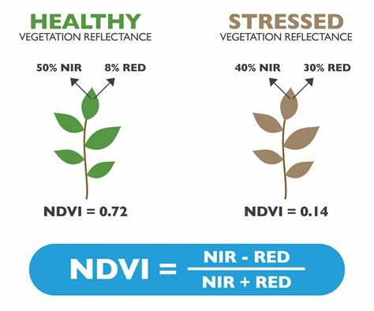

# -Dhaka-s-Environmental-Changes-with-NDVI-and-LULC-2014-2024-
I used ArcGIS Pro to look at how Dhaka changed from 2014 to 2024. Concrete and buildings basically doubled (+14.55%), swallowing up a massive amount of farmland. The scariest part? Even though we see a bit more green on the map, the NDVI data shows our trees are choking—unhealthy greenery jumped by 2.6% due to urban heat and pollution.
# Decadal Spatial Analysis of Dhaka District: Urbanization & Ecological Dynamics (2014 VS 2024)

This repository contains the geospatial data, maps, and analysis evaluating the environmental and structural evolution of Dhaka District over a 10-year timeline. Using ArcGIS Pro and multi-temporal satellite imagery, this project quantifies macro-level shifts in land cover and tracks the corresponding physiological stress on regional vegetation. 

By pairing Land Use Land Cover (LULC) classification with Normalized Difference Vegetation Index (NDVI) anomalies, this analysis provides a data-driven assessment of how rapid urban growth alters local ecosystems.

---

## 📈 Methodology

### 1. Land Use Land Cover (LULC) Classification
Surface evaluation is segmented into five primary thematic layers to capture macro environmental metrics: Water, Developed Areas, Agricultural Land, Vegetation/Trees, and Bare Land.

#### Decadal LULC Comparison
Here is the spatial distribution of land classes across the district comparing the 2014 baseline against 2024 conditions:

  
  

| Surface Classification | 2014 Area (%) | 2024 Area (%) | Net Absolute Shift (%) |
| :--- | :---: | :---: | :---: |
| **Developed Areas** | 13.33% | 27.88% | **+14.55%** |
| **Water Bodies** | 16.75% | 18.92% | **+2.17%** |
| **Vegetation / Trees** | 20.34% | 23.18% | **+2.84%** |
| **Agricultural Land** | 27.86% | 19.37% | **-8.49%** |
| **Bare Land** | 21.69% | 10.72% | **-10.97%** |

---

### 2. Normalized Difference Vegetation Index (NDVI)
Vegetation health and biomass density are calculated via standard band math using satellite-derived reflectance data. By comparing the differential reflection of near-infrared (NIR) and visible red light, plant vigor is measured using the standard equation:

$$NDVI = \frac{NIR - Red}{NIR + Red}$$

  

#### Decadal NDVI Comparison
The maps below display the spatial distribution of vegetation vigor and localized stress over the ten-year period:

  
  

| Biomass Profiling Range | 2014 Presence (%) | 2024 Presence (%) | Net Structural Shift (%) |
| :--- | :---: | :---: | :---: |
| **Unhealthy Plants** | 23.60% | 26.20% | **+2.60%** |
| **Dead Plants / Non-Vegetated Objects** | 6.85% | 6.40% | **-0.45%** |
| **Moderately Healthy Plants** | 33.57% | 32.44% | **-1.13%** |
| **Very Healthy Plants** | 35.97% | 34.80% | **-1.17%** |

---

## 🔍 What the data reveals

* **Impervious Growth:** The 14.55% surge in developed space stems directly from reclaiming bare land (-10.97%) and converting agrarian zones. This shift significantly modifies regional thermal characteristics and urban hydrology.
* **Vegetation Paradox:** While total canopy coverage rose marginally (+2.84%), very healthy vegetation dipped by 1.17% and unhealthy variants climbed by 2.60%. This indicates physiological degradation, likely caused by groundwater depletion, soil fragmentation, and localized air pollutants.
* **Agrarian Insecurity:** Losing 8.49% of active agricultural land directly reduces localized food production capabilities within the district perimeter, highlighting the need for firmer land zoning policies.

---

## 🛠️ Tech Stack & Software
* **GIS Engine:** ArcGIS Pro
* **Data Processing:** Remote Sensing Imagery Band Radiance Processing
* **Calculations:** Raster Functions (NDVI / Iso-Cluster Unsupervised LULC Classification)
